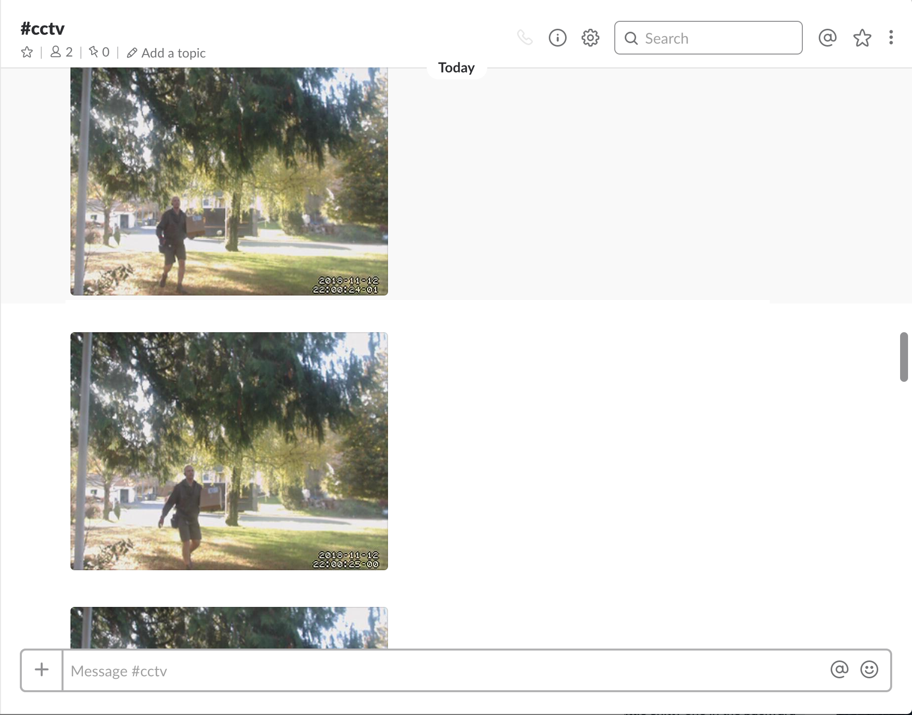

# Security camera

This is a guide to creating a simple security camera using a Raspberry Pi, USB 
webcam, Amazon S3, Slack.



- [Prerequisites](#prerequisites)
  - [Raspberry pi](#raspberry-pi)
    - [Base configuration](#base-configuration)
  - [USB Webcam](#usb-webcam)
- [Device Setup](#device-setup)
  - [Install dependencies](#install-dependencies)
  - [Configure motion](#configure-motion)
- [S3 setup](#s3-setup)
- [Slack setup](#slack-setup)
- [Uploading images](#uploading-images)


# Prerequisites

## Raspberry Pi

[RaspberryPi 3](https://www.raspberrypi.org/products/raspberry-pi-3-model-b/) is used for this build.
They include builtin Wi-Fi, making them well suited for this usecase.

### Base Configuration

Configure the Raspberry Pi as follows:
- [Raspbian Stretch Lite](https://www.raspberrypi.org/downloads/raspbian/) is the OS this guide was tested with
- Setup ssh access to the pi
- Connect the pi to your wireless network

Setting up ssh access and configuring the wireless is outside of the scope of this guide.
I've found [this guide](https://medium.com/@danidudas/install-raspbian-jessie-lite-and-setup-wi-fi-without-access-to-command-line-or-using-the-network-97f065af722e) to 
be helpful for that.

### USB Webcam

A USB webcam is used for this project. Any USB camera should do, I'm using a [Logitech C920 Webcam](https://www.amazon.com/gp/product/B006JH8T3S).


# Device Setup

## Install dependencies


```
sudo apt-get update

# usb camera support
sudo apt-get install fswebcam

# Install motion
sudo apt-get install motion
```

Test the camera with `fswebcam`
```
fswebcam image.jpg
```
```
--- Opening /dev/video0...
Trying source module v4l2...
/dev/video0 opened.
No input was specified, using the first.
Adjusting resolution from 384x288 to 352x288.
--- Capturing frame...
Captured frame in 0.00 seconds.
--- Processing captured image...
Writing JPEG image to 'image.jpg'.
```
Now we know our webcam is at `/dev/video0`. If you look at `image.jpg` you'll see the picture it took.


## Configure motion

[Motion](https://motion-project.github.io/) is used to monitor the camera.

Edit the following settings in the motion configuration file at `/etc/motion/motion.conf`

```
# Make sure the proper camera device is set
videodevice /dev/video0

# Tell motion to run as a background service
daemon on
```

Edit `/etc/default/motion` and set `start_motion_daemon=yes`
```
start_motion_daemon=yes
```

And restart the system
```
reboot
```

Once it comes back up open another ssh connection.

Confirm motion is running
```
systemctl status motion
```

At this point motion is running as a background service and will be automatically
started after a reboot. The next section will guide you through uploading the images
to AWS S3 and notifying a Slack channel.

# S3 Setup

1. Create an S3 bucket, noting the name and region
2. Create an IAM user, noting the AWS_ACCESS_KEY_ID and AWS_SECRET_ACCESS_KEY
3. Create and attach an IAM policy to the user, allowing them to upload to the S3 bucket
  ```
  {
      "Version": "2012-10-17",
      "Statement": [
          {
              "Sid": "cctv_upload",
              "Effect": "Allow",
              "Action": [
                  "s3:PutObject",
                  "s3:PutObjectAcl"
              ],
              "Resource": "arn:aws:s3:::YOUR-BUCKET-NAME/*"
          }
      ]
  }
  ```

# Slack Setup

1. Create a [Slack incoming webhook](https://api.slack.com/incoming-webhooks)
2. Note the Webhook URL, e.g. https://hooks.slack.com/services/xxx/yyy/zzzzz

# Uploading images

[cctv_upload](./cmd/cctv_upload) is a small Go program that ties the system together.
It's called by `motion` when a new image is created. The program uploads the image
to S3 and then sends a webhook to Slack with the image url.

Build the code
```
make build
```

Upload it to the pi
```
scp ./bin/cctv_upload pi@your_ip:/usr/local/bin/cctv_upload
```

Ssh to the pi and export the following env vars:
```
export SLACK_WEBHOOK_URL=<your slack webhook url>
export S3_BUCKET_NAME=<your s3 bucket name>
export S3_BUCKET_REGION=<region for your s3 bucket>
export AWS_ACCESS_KEY=<your aws access key>
export AWS_SECRET_KEY=<your aws secret key>
```
